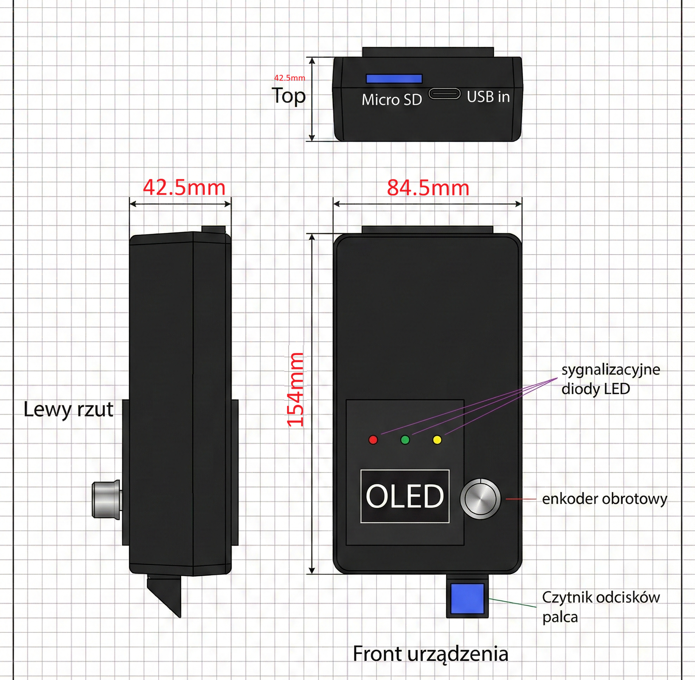
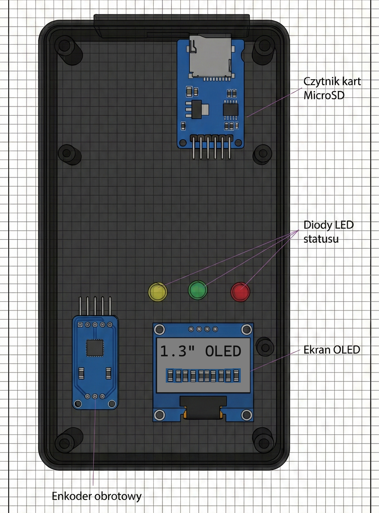
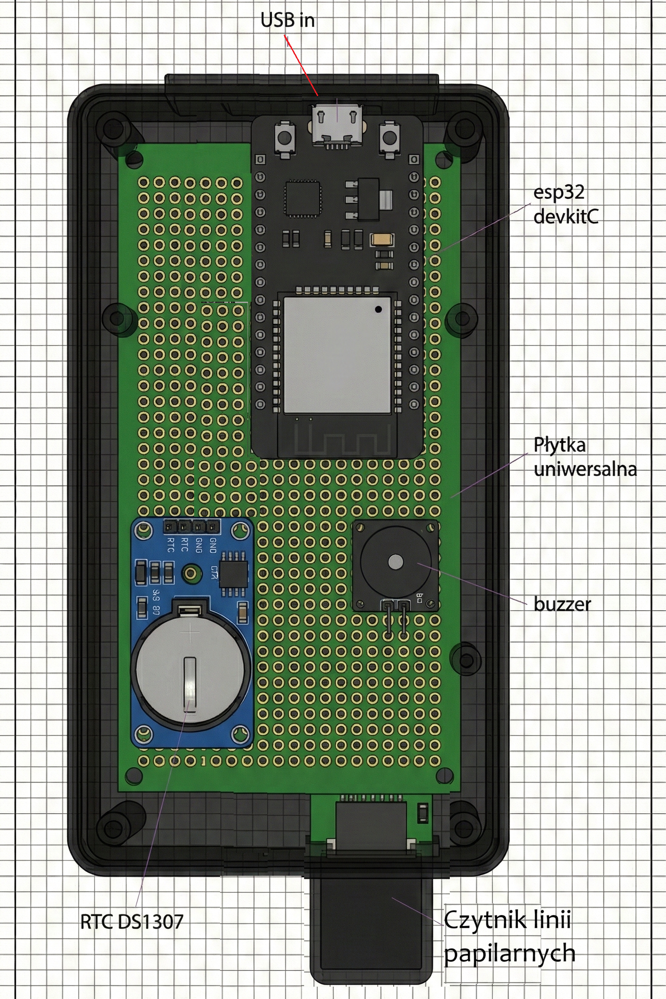

# ESP32-Biometric-Time-Tracker
An ESP32-based biometric time and attendance system using R307 fingerprint sensor, OLED display, and SD card logging.

# Biometric Time & Attendance System (ESP32)

An embedded IoT project for tracking work, study, and break times using biometric authentication. Built with **ESP32**, **ESP-IDF (C)**, and a custom **Altium Designer PCB**.

 

## 📌 Project Overview
This system operates as a standalone Time and Attendance tracker. It uses the **R307s optical fingerprint sensor** to authenticate users and logs their activity to a locally mounted **MicroSD card** in CSV format. The device includes a background timer to ensure users take breaks and don't exceed their daily limits - which can be setup via SD card files.

### ✨ Key Features
* **Biometric Authentication:** Stores up to 1000 fingerprints using the DSP-powered R307s sensor.
* **Hardware Timers:** DS1307 RTC module with battery backup for accurate timekeeping.
* **Menu Navigation:** Rotary encoder input paired with a 1.3" OLED display (I2C).
* **Alert System:** Visual (LEDs) and audio (Buzzer) feedback for access control and time limits.
* **Configuration:** Loads runtime parameters (break limits, work hours) from an SD card `.txt` file without recompiling.

## 🛠️ Hardware Architecture
The hardware was designed from scratch using **Altium Designer**. 
* **MCU:** ESP32-WROOM-32 (ESP32 DevKitC)
* **Sensor:** R307 Optical Fingerprint Sensor (UART)
* **Display:** 1.3" OLED SH1106 (I2C)
* **Storage:** SPI MicroSD Card Adapter
* **Logic Level Shifting:** Voltage dividers to protect 3.3V ESP32 RX pins from 5V sensor logic.

> 📄 **View Schematics:** [Hardware/SystemRCP_Schematic_Diagram.pdf](Hardware/SystemRCP_Schematic_Diagram.pdf)

> 📄 **View PDB Layout:** [Hardware/PCB_Layout.pdf](Hardware/PCB_Layout.pdf)

 

 

 
## 💻 Software details
Developed strictly using **ESP-IDF** (FreeRTOS based).
* Implements a non-blocking state machine in the main task.
* Interrupt Service Routines (ISRs) handle rotary encoder inputs.
* Employs `esp_vfs_fat` for SD Card FAT32 file system mapping.

## 🚀 How to build
This project uses the standard ESP-IDF CMake build system.
1. Clone this repository.
2. Navigate to the components folder: `cd Software/components`
3. Clone the u8g2 library: `git clone https://github.com/olikraus/u8g2.git`
4. Open the project in VS Code with the ESP-IDF extension.
5. Run `idf.py build` and `idf.py flash`.

## 🎓 About
This project was initially developed as an academic assignment (Grade: 5.0) and is currently being expanded into a cloud-connected IoT system.
